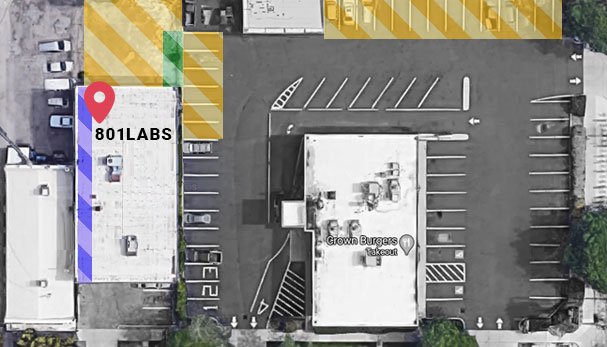

# Contact Us!

Come visit our hackerspace! We're open to the public — stop by, check out the space, and meet the community.

----

  

    <h2>Visit the Hackerspace</h2>
    
353 East 200 South Suite #201, Salt Lake City, UT 84111

    
The entrance is on the north / back side of the building. Walk through the tunnel off 200 South or use the gate in the Crown Burger parking lot. Street parking is plentiful in the area.

    <iframe
      class="google_maps"
      src="https://www.google.com/maps/embed?pb=!1m18!1m12!1m3!1d3022.2!2d-111.8862!3d40.7645!2m3!1f0!2f0!3f0!3m2!1i1024!2i768!4f13.1!3m3!1m2!1s0x8752f510e3a0a955%3A0x938e7c98e0fb2b47!2s353%20E%20200%20S%20%23201%2C%20Salt%20Lake%20City%2C%20UT%2084111!5e0!3m2!1sen!2sus!4v1700000000000!5m2!1sen!2sus"
      width="100%"
      height="400"
      style="border: 2px solid var(--grey-utility);"
      allowfullscreen=""
      loading="lazy"
      referrerpolicy="no-referrer-when-downgrade"
    ></iframe>
  

  

    <h2>Chat on Discord</h2>
    
Can't make it in person? Our Discord is the next best thing.

    <iframe
      class="discord_widget"
      src="https://discord.com/widget?id=690230523615772736&theme=dark"
      width="100%"
      height="400"
      allowtransparency="true"
      frameborder="0"
      sandbox="allow-popups allow-popups-to-escape-sandbox allow-same-origin allow-scripts"
    ></iframe>
  

----

## Schedule

Hours: Thursdays from 5:00 PM to 10:00 PM and other days by announcement.

We are open to the public whenever our key-holding associates and officers are available to run the space. Ask our Discord Server.

[Join Discord >](https://discord.gg/7pBUdwv9Gr)

[Meetup With Us at our upcoming events >](../#Upcoming-Events)

### Holiday Hours

Ask on our Discord Server or check our social media for changes.

----

## Entrance

The entrance is on the north / back side of the building. To get there, walk through the tunnel off 200 South or use the gate in the Crown Burger parking lot.

## Parking

Street parking is plentiful in the area, however, lot parking is limited. Please use the back entrance as found on the diagram below.

----

## Other ways to reach us

* Email the Board: [board@801labs.org](mailto:board@801labs.org)
* Find us on [Meetup](https://www.meetup.com/801labs/) for upcoming events
* Follow us on [Twitter](https://twitter.com/801labs)
* Check out our [GitHub](https://github.com/801labs/)